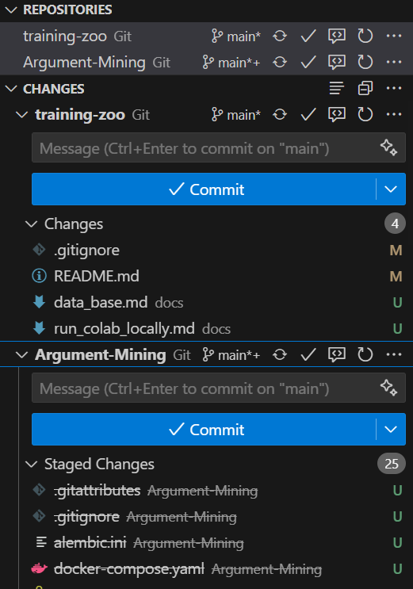

# Connection to the database

## Issues

### Multiple repositories

When cloning the database repository in Google Colab, it creates a copy of the repository in your Google Drive. This can lead to confusion and issues when trying to run the notebooks locally, as you may end up with multiple copies of the same repository.
Cloning the db repository in collab works fine but causes issues when developing locally. Its anoing to have multiple copies of the same repo.

Maybe build db repo as a python package?

### Naming conventions
The "-" in the name of the database repository causes issues when importing the repository in Python. This is because the "-" character is not allowed in Python variable names. To avoid this issue, it is recommended to use "_" instead of "-" in the name of the repository. This will make it easier to import and use the repository in Python code.